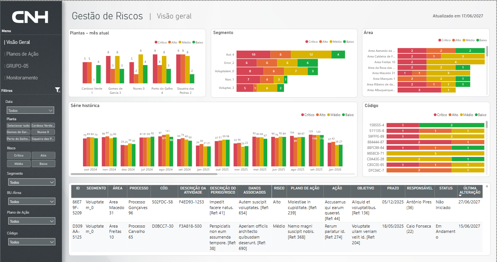
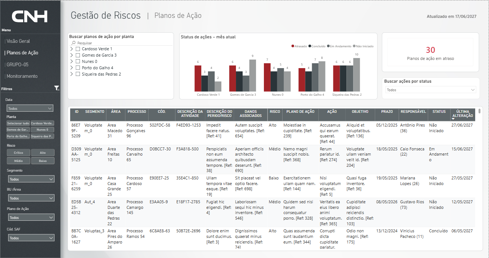
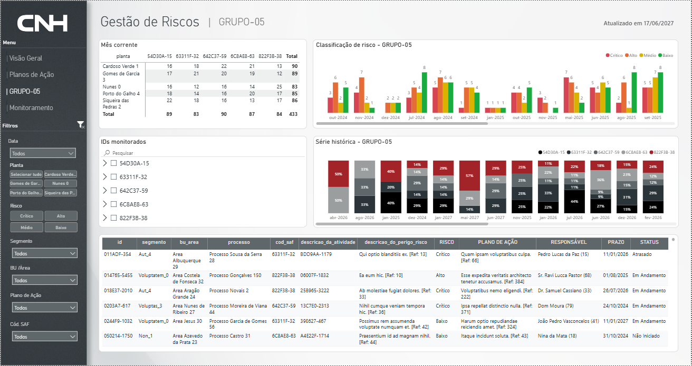
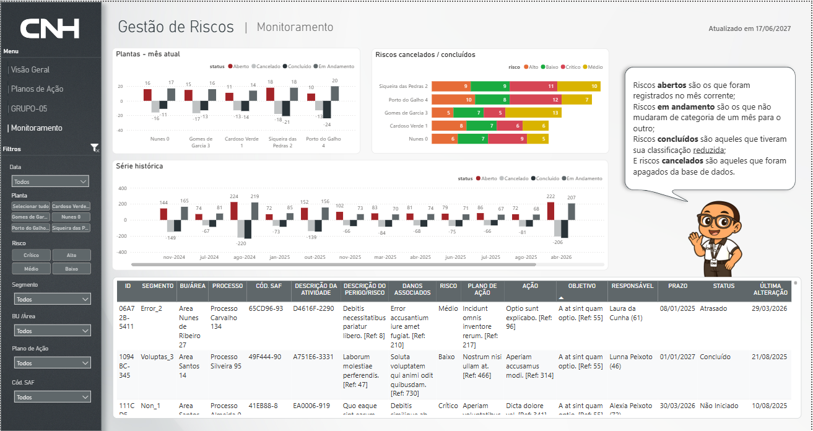

# 🧠 SHEQ Data Platform (End-to-End Data Engineering & Analytics Project)

This project is an end-to-end data platform designed to ingest, transform, integrate, and analyze SHEQ (Safety, Health, Environment & Quality) data from multiple sources.

It combines data engineering and analytics to deliver a complete solution for risk data processing, time-series modeling, and business intelligence, enabling full visibility into risk lifecycle and supporting data-driven decision-making.

---

## 🚀 Overview

The solution processes data from:

- Historical datasets (CSV files)
- External APIs
- Action plan systems

It transforms raw data into structured, analytics-ready datasets using a multi-layer architecture.

---

## 🏗️ Architecture

```
DATA SOURCES
├── CSV (historical data)
├── External APIs
└── CSV (action plans)
    ↓

INGESTION LAYER
├── historical/
└── api/
    ↓

INTEGRATION LAYER
└── action_plan/
    ↓

CORE PROCESSING
└── sheq_complete/
    ↓

ANALYTICS LAYER
├── sheq_monthly/
└── sheq_status/
    ↓

OUTPUT
├─ Structured Delta Tables
├─ Analytical Data Model
└─ Power BI Dashboard
```

---

## 📂 Project Structure

```text
sheq-data-pipeline/
│
├── historical/         → Historical CSV ingestion
├── api/                → API data ingestion
├── action_plan/        → Multi-source integration (API + CSV)
├── sheq_complete/      → Unified dataset (core processing layer)
├── sheq_monthly/       → Monthly analytical snapshots
├── sheq_status/        → Risk lifecycle and status monitoring
│
├── sample_data/
|   ├── action_plan_sample.csv
│   ├── sheq_monthly_sample.csv
│   └── sheq_status_sample.csv
│
├── dashboard/          → Power BI dashboard assets and previews
|   ├── SHEQ_Risk_Analytics.pbix
│   ├── executive_overview.png
│   ├── action_plan_management.png
│   ├── risk_group_analysis.png
│   └── risk_lifecycle_monitoring.png
│
├── config/             → Configuration templates (no secrets)
│
├── README.md           → Project documentation
│
└── architecture
    └── data_flow.png   → Solution architecture diagram
```

---

## ⚙️ Pipeline Modules

### 🔹 1. Historical Pipeline
- Processes CSV-based historical data
- Standardizes schema and cleans inputs

---

### 🔹 2. API Pipeline
- Extracts data from external REST APIs
- Handles pagination and retries
- Transforms semi-structured JSON into structured format

---

### 🔹 3. Action Plan Pipeline
- Integrates API and CSV data sources
- Normalizes schemas
- Applies business rules

---

### 🔹 4. SHEQ Complete Pipeline
- Combines historical and API datasets
- Applies deduplication logic
- Enriches data with action plan information

---

### 🔹 5. Monthly Snapshot Pipeline
- Generates latest state per record per month
- Supports full and incremental loads
- Optimized for time-series reporting

---

### 🔹 6. Status Pipeline (State Machine)
- Builds a complete time series
- Tracks record evolution over time
- Classifies transitions:

| Status     | Description |
|-----------|------------|
| NEW       | First occurrence or increased risk |
| UNCHANGED | No change |
| MITIGATED | Risk reduction |
| DELETED   | Record removed |

---

## 📊 BI & Analytics Layer

A Power BI reporting layer was developed on top of the curated analytical datasets generated by the pipeline, enabling interactive exploration of risk indicators, action plans and operational performance.

The dashboards transform processed SHEQ data into actionable insights, supporting monitoring activities, risk governance and data-driven decision-making across multiple plants and business areas.

### Key Features

- Executive risk monitoring and KPI tracking
- Risk lifecycle analysis (Open, In Progress, Completed and Cancelled)
- Action plan governance and overdue action monitoring
- Historical trend analysis and monthly performance tracking
- Risk classification and prioritization analysis
- Plant, area and business segment comparison
- Interactive filtering and drill-down capabilities

### 📷 Dashboard Preview

#### Executive Overview

Provides a consolidated view of risks, including distribution by plant, segment and business area, along with historical performance trends and detailed operational records.



#### Action Plan Management

Supports monitoring of corrective and preventive actions, enabling users to track responsibilities, deadlines, execution status and overdue items.



#### Risk Group Analysis

Offers detailed analysis of monitored risk groups, including classification trends, historical evolution and operational-level records.



#### Risk Lifecycle Monitoring

Tracks risk status transitions over time, providing visibility into open, in-progress, completed and cancelled records to support continuous improvement initiatives.



---

## 🧠 Key Features

### ✅ End-to-End Data Pipeline
- Covers the full data lifecycle:
  ingestion → transformation → integration → analytics

---

### ✅ Multi-Source Data Integration

- Integrates historical datasets, REST APIs and action plan records into a unified data platform
- Consolidates heterogeneous data sources into a standardized analytical model
- Handles schema inconsistencies, data type mismatches and source-specific structures
- Supports scalable ingestion workflows for structured and semi-structured data

---

### ✅ Robust Data Processing

- Advanced data cleansing, validation and normalization routines
- Resilient handling of null values, inconsistent formats and duplicate records
- Metadata-driven transformations using PySpark
- Automated quality checks to improve data reliability and consistency

---

### ✅ Advanced Transformations

- Window-based deduplication and record prioritization
- Dynamic pivoting, aggregation and reshaping
- Cross-source enrichment and business rule application
- Forward-fill logic and temporal continuity processing

---

### ✅ Time-Series Modeling

- Monthly analytical snapshot generation
- Historical timeline reconstruction for each monitored record
- Period-over-period comparison capabilities
- Partitioned datasets optimized for scalable analytical workloads

---

### ✅ Risk Lifecycle Intelligence

- Tracks the evolution of risks across reporting periods
- Identifies lifecycle transitions such as NEW, MITIGATED, DELETED and UNCHANGED
- Enables historical monitoring and trend analysis
- Supports proactive risk management and operational visibility

---

### ✅ Business Intelligence & Analytics

- Curated datasets designed for analytical consumption
- Power BI dashboards built on trusted and standardized data models
- Executive risk monitoring and KPI tracking
- Action plan governance and status monitoring
- Historical trend analysis and performance reporting
- Interactive dashboards supporting drill-down and self-service analytics

---

### ✅ End-to-End Analytics Architecture

- End-to-end workflow from ingestion to visualization
- Modular and maintainable pipeline design
- Medallion-inspired analytical processing approach
- Delta-based datasets optimized for reporting workloads
- Supports operational monitoring and data-driven decision-making

---

## 🔐 Security & Configuration

This repository follows security and governance best practices by excluding sensitive information, credentials and proprietary data from version control.

All configuration files containing secrets, API tokens or connection details are intentionally omitted from the repository.

### Configuration Template

Use the template below as a reference for local development:

```text
config/api_keys.example.json
```

### Local Setup

1. Create the configuration file:

```text
config/api_keys.json
```

2. Copy the structure from:

```text
config/api_keys.example.json
```

3. Populate the file with your own credentials and environment-specific settings.

### Security Notes

- Credentials are never committed to the repository
- API keys and secrets should be stored in secure secret management solutions whenever possible
- Local configuration files are excluded through `.gitignore`
- Sample and mock data are used to demonstrate the solution without exposing sensitive information

---


## 📊 Sample Data

Representative sample datasets are included to allow users to explore the solution and open the Power BI report without requiring access to the original data sources.

### Available Datasets

```text
sample_data/
├── action_plan_sample.csv
├── sheq_monthly_sample.csv
└── sheq_status_sample.csv
```

### Data Characteristics

All datasets are:

- Fully anonymized
- Generated for demonstration purposes
- Structurally equivalent to production data
- Compatible with the Power BI report included in this repository
- Free of confidential or proprietary information

### Usage

The sample datasets can be used to:

- Execute and validate transformation logic
- Understand the analytical data model
- Reproduce Power BI dashboard visualizations
- Explore KPI calculations and business metrics
- Test the end-to-end analytics workflow

> **Note:** Sample data was created exclusively for portfolio and educational purposes and does not contain any real business information.

---

## 📈 Output

The project generates structured, analytics-ready datasets stored as Delta tables, including:

---

### 🔹 Monthly Snapshot (sheq_monthly)
- Latest state of each record per month
- Time-partitioned for efficient queries
- Ideal for time-series reporting

---

### 🔹 Status Tracking Dataset (sheq_status)
- Full timeline of each record
- State transitions (NEW, MITIGATED, DELETED, UNCHANGED)
- Includes analytical metrics such as:
  - status_code
  - weight (impact indicator)

---

### 📊 BI & Analytics Layer

The processed and curated datasets are consumed by an interactive Power BI solution designed to transform operational data into actionable business insights.

The analytics layer provides a centralized view of risk exposure, mitigation activities and performance indicators, enabling users to monitor trends, investigate issues and support data-driven decision-making.

#### Analytical Capabilities

- Executive risk monitoring and KPI tracking
- Risk lifecycle and status transition analysis
- Action plan governance and follow-up
- Historical trend and performance analysis
- Risk classification and prioritization monitoring
- Cross-plant, area and segment comparison
- Interactive filtering and drill-down exploration

#### Business Dashboards

- Executive Overview
- Action Plan Management
- Risk Group Analysis
- Risk Lifecycle Monitoring

---

### 🎯 Business Value

The platform delivers value by connecting raw operational data to meaningful business outcomes through a scalable analytics architecture.

Key benefits include:

- End-to-end visibility of the risk management lifecycle
- Centralized monitoring of risks and mitigation actions
- Improved governance and action plan accountability
- Early identification of trends, recurring issues and critical scenarios
- Enhanced operational transparency across plants and business areas
- Historical analysis to support continuous improvement initiatives
- Faster and more reliable access to decision-ready information
- Support for both strategic and operational decision-making
- Reduction of manual reporting efforts through automated data processing and visualization

---

## 🧩 Technologies Used

- **PySpark**
- **Delta Lake**
- **Databricks**
- **REST APIs**
- **Python**
- **Power BI**

---

## 🧠 What This Project Demonstrates

- Real-world data engineering pipelines
- Multi-layer architecture (ingestion → transformation → serving)
- Handling of messy, real-world datasets
- Business logic implementation in data pipelines
- Analytical modeling for risk tracking

---

## 🔒 Disclaimer

This repository contains a **sanitized version** of a real-world project:

- No sensitive data is included
- All names and identifiers are anonymized
- API endpoints and credentials are abstracted

---

## ⭐ Final Notes

This project was designed to simulate a production-grade data pipeline environment, focusing on scalability, maintainability, and data quality.

---

## 👤 Author
Data Analytics Intern

Focus: Data Engineering, Automation & Business Intelligence

---

## 📬 Contact

Feel free to reach out for questions or discussions about this project.


